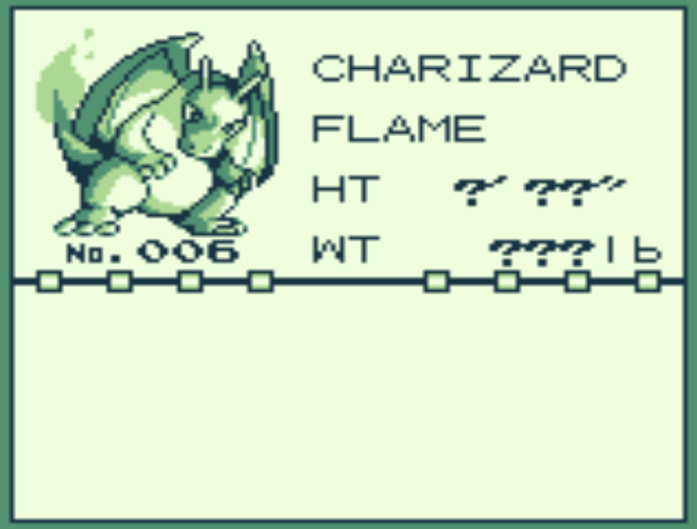
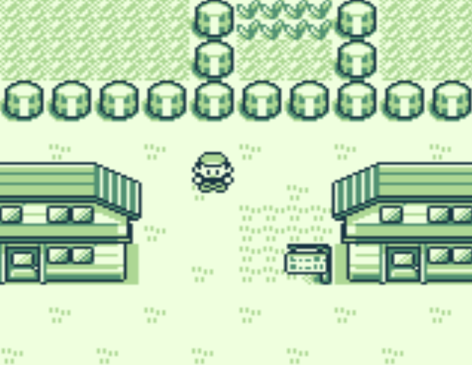
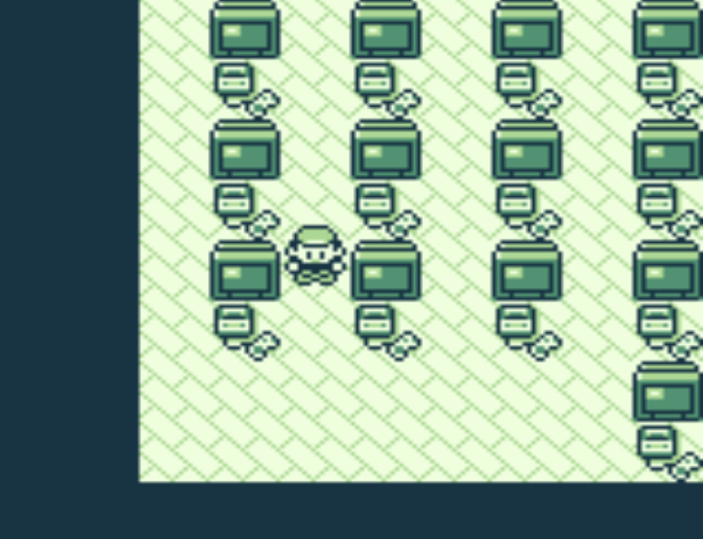
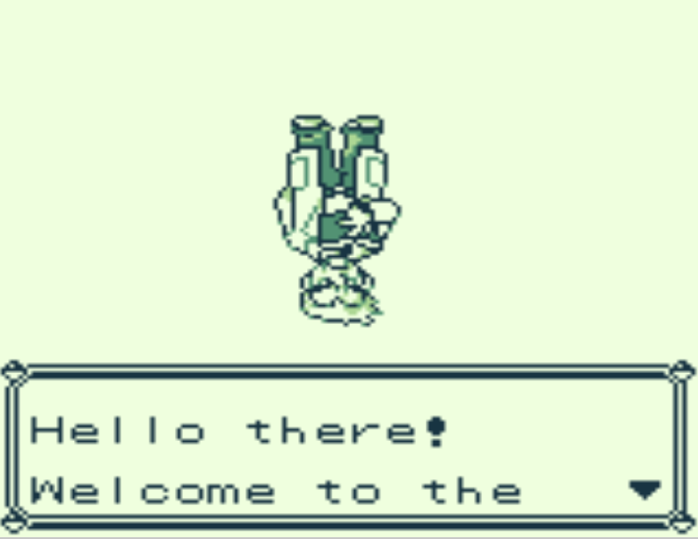

# Pokémod

A small collection of Pokémon Red & Blue Gameboy game mods. You can download and play each mod online with [GameBoy Online](https://taisel.github.io/GameBoy-Online/) or any GBC emulator. Each mod is a branch of [pret/pokered](https://github.com/pret/pokered).

## **Super Starters**
[Download Red](https://github.com/brannondorsey/pokemods/releases/download/data/pokered-super-starters.gbc) | [Download Blue](https://github.com/brannondorsey/pokemods/releases/download/data/pokeblue-super-starters.gbc) | [Code](https://github.com/brannondorsey/pokemods/tree/super-starters)

The three starting pokémon are Charizard, Blastoise, and Venusaur.

<!-- 
## **Too Much Mewtwo**
Every pokémon in the game has been replaced with Mewtwo. -->

## **Pleasant Town**

[Download Red](https://github.com/brannondorsey/pokemods/releases/download/data/pokered-pleasant-town.gbc) | [Download Blue](https://github.com/brannondorsey/pokemods/releases/download/data/pokeblue-pleasant-town.gbc) | [Code](https://github.com/brannondorsey/pokemods/tree/pleasant-town)

The road out of Pallet Town has been blocked. The game is transformed into a quaint life-simulator about a sleepy town. 

## **SNES Room**

[Download Red](https://github.com/brannondorsey/pokemods/releases/download/data/pokered-snes-room.gbc) | [Download Blue](https://github.com/brannondorsey/pokemods/releases/download/data/pokeblue-snes-room.gbc) | [Code](https://github.com/brannondorsey/pokemods/tree/snes-room)

Ash's room is full of Super Nintendo consoles.

## **Upside Down**

[Download Red](https://github.com/brannondorsey/pokemods/releases/download/data/pokered-upside-down.gbc) | [Download Blue](https://github.com/brannondorsey/pokemods/releases/download/data/pokeblue-upside-down.gbc) | [Code](https://github.com/brannondorsey/pokemods/tree/upside-down)

Player and pokémon sprites have been rotated 180 degrees.

